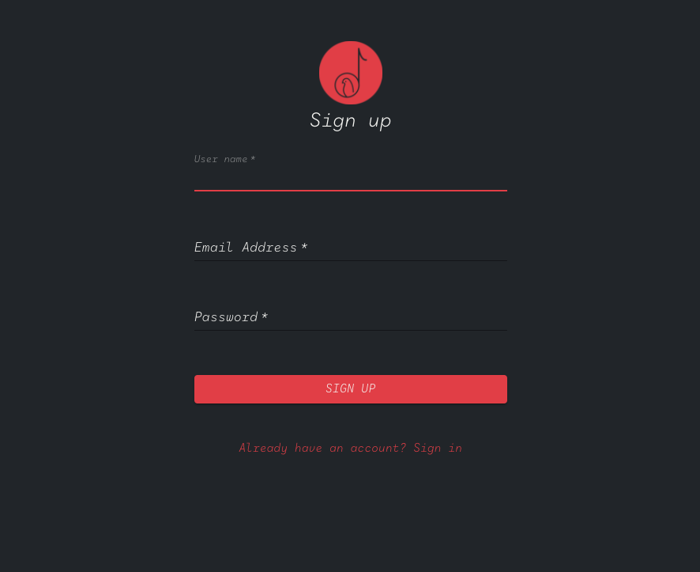

# Parakeet

Parakeet is a website that creates a space for people to share music with friends, family, coworkers, and fellow music lovers around the world!

Application build with the following key technologies:
* [Firebase](https://firebase.google.com/)
* [Spotify API](https://developer.spotify.com/documentation/general/guides/)
* [Mapbox](https://www.mapbox.com/)


## Applicaton Screenshots
Landing Page


|               Sign In               |               Sign Up               |              Forgot Password               |
| :---------------------------------: | :---------------------------------: | :----------------------------------------: |
|  |  |  |

Home Screen


Map View


Settings


## Developer Installation and Setup
### Prerequisites
* [Yarn](https://classic.yarnpkg.com/en/docs/install/#mac-stable)
* [git](https://git-scm.com/book/en/v2/Getting-Started-Installing-Git)
* [Node.js](https://nodejs.org/en/download/)

### Get the project
```bash
git clone https://github.com/James-W-Berry/Parakeet.git

# install required packages with yarn
cd Parakeet/
yarn
```

### Environment Variables
The local authentication server and base project require environment variables to successfully communicate with Firebase, Spotify, and Mapbox. In the project root, create an environment variable file:
```bash
touch .env
```
Add the following environment variables to the .env. Please reach out to the [project owner](https://github.com/James-W-Berry) for secrets. 
```
REACT_APP_LOGIN_URL=***
REACT_APP_DEV_LOGIN_URL=http://localhost:8888/login
REACT_APP_CLIENT_ID=***
REACT_APP_CLIENT_SECRET=***
REACT_APP_MAPBOX_API_KEY=***
REACT_APP_MAPBOX_STYLE_URL=***
```

### Setup Local Authentication Server
Parakeet utilizes Cloud Functions from Google Cloud Platform to enable authentication with Spotify. Instead of invoking this function during development, it is recommended to setup an authentication server on a local machine.

The authentication server source code can be found at Parakeet/dev/. Before developing a new feature for Parakeet on a local development machine, start the authentication server. You should see confirmation of the authentication server listening on port 8888.
```bash
node dev/spotify-auth-server/authorization_code/app.js
```
Next, ensure the application will refer to the local authentication server when trying to retrieve a new Spotify access token. Review the SpotifyPlayerUI and SpotifyLogin components located in src/components and set the appropriate variable for the local development server.

### Start the application
```bash
yarn start # application running at http://localhost:3000.com
```

